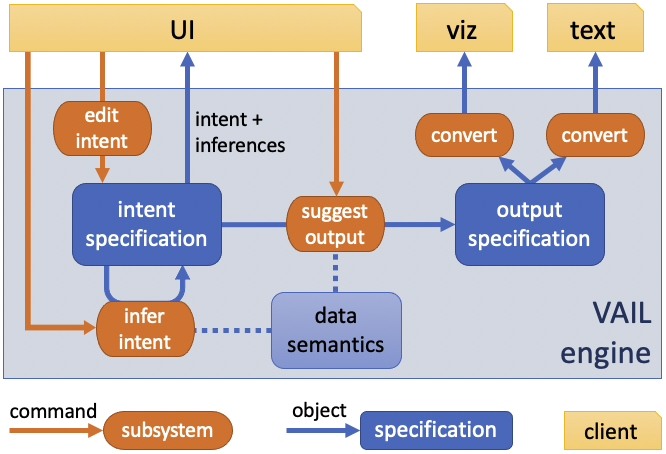

# VAIL

Prototype for VAIL (Visual Analytic Intent Language).

* [Why VAIL?](#why-vail)
* [Demo](#demo)
* [Get started](#get-started)
	* [Prerequisites](#prerequisites)
	* [Installation](#installation)
	* [Configuration](#configuration)
* [Run VAIL](#run-vail)
* [Use VAIL](#use-vail)

# Why VAIL?

VAIL is a language for modeling user intent, inferring missing or ambiguous intent, and figuring out how to effectively visualize intent.
Importantly, the user interacts with the *intent*, seeing and modifying it, rather than with the *visualization*, as you would with a system such as Tableau.

* **specifications**
    * **intent**: models user intent
    * **output**: an abstract description of an effective visualization
* **engine**
    * **infer intent**: infers missing or ambiguous information in a set of *intent specifications*
    * **suggest output**: figures out effective visualizations, taking *intent specifications* and creating an *output specification*
* **converters**: converts an *output specification* into a specific visualization format such as VizQL or text
* **commands**
    * **edit**: CRUD operations on *intent specifications*
    * **manager**: convert between different types of specifications

# Demo

Run the latest version [here](https://octo.gitlab.pages.tableausoftware.com/research/vail-proto/).

# Get started

This section describes how to install and configure VAIL.

## Prerequisites

To work with VAIL, you need the following:

* A browser such as Firefox, Chrome, Edge, or Safari
* Install [NPM](https://www.npmjs.com/get-npm)
* Install [Typescript](https://www.npmjs.com/package/typescript)

## Installation

To install VAIL, follow these steps:

* Clone VAIL

## Configuration

After you've installed or cloned VAIL, configure it by following these steps:

* At a command prompt, run `npm install`

# Run VAIL

To run VAIL, follow these steps:

* If you wish to have it automatically rebuilt after every edit:
    * At a command prompt, run `npm start`.
    * This will load the sample page in the browser at http://localhost:3000
* If you wish to have it automatically rerun all the automated tests after every edit:
    * At a command prompt, run `npm test`.

# Use VAIL

To learn how to use VAIL, see the [documentation](docs/README.md)
