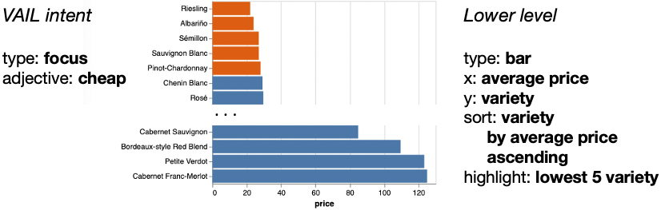

# Using the VAIL engine

VAIL (Visual Analytics Intent Language) is a library that lets you build systems that enable users to explore a data set by expressing a higher-level "intent" for what they want to see, e.g., "show me the cheap wines" or "show the trend", rather than a more typical, lower-level technical description of *how* to display it, e.g., "make a row for each wine variety and show a bar chart where the length is based on price, sorted by price."



The input intent might be ambiguous and may be expressed via natural language or through a GUI, or be generated from a recommendation system.
The output might be a visualization (e.g., a bar chart or scatter plot), text, or speech.
Because of ambiguity in the input, there may be more than one recommended description for output.

Say, for example, that you'd like to build a system that supports an interaction like the following, where the actual input and output are application specific:

>>>
User: *"Show me the best wines from the wine data set."*

System: *"You probably want varities, or maybe names. You probably want it sorted by points, or maybe price. So, here's a list of wine varieties by points, sorted from most to least points."*

User: *"Show names instead."*

System: *"Here's a list of wine names by points, sorted from most to least points."*
>>>

Here's what the interaction with VAIL code looks like to drive that scenario:

```javascript
// "Show me the best wines from the wine data set."
const vail = newVailInstance();
vail.doCommand({ command: 'setDataSemantics', fieldInfo: wineFields });
vail.doCommand({ command: 'setIntent',
  intent: { intentType: 'focus', adjective: 'best', id: 1 } });
vail.doCommand({ command: 'inferIntent' });
customIntentDisplay(vail.getIntent());
vail.doCommand({ command: 'suggestOutput' });
customOutputDisplay(vail.getOutput());

// "Show names instead."
vail.doCommand({ command: 'setIntent',
  intent: { intentType: 'focus', field: 'name', adjective: 'best', id: 1 } });
vail.doCommand({ command: 'inferIntent' });
vail.doCommand({ command: 'suggestOutput' });
customOutputDisplay(vail.getOutput());
```

This touches on the core VAIL concepts: describing a data source, setting and modifying intent, inferring missing or ambiguous intent, suggesting appropriate output, and communicating the output to the user.
Below, we'll give a brief overview of each of these topics, with links to more details.


## Describing data

VAIL reasons about a table of data through knowledge of the semantics of the fields in the table.
The above example showed an interaction with a table where each row is a wine and each column is a property of the wine, which might look like the following:

| variety | price | points | name |
| ---     | ---   | ---    | ---  |
| Cabernet Sauvignon | 45 | 92 | Silverado 2006 Cabernet Sauvignon |
| Cabernet Sauvignon | 78 | 91 | Clark-Clauden 2007 Cabernet Sauvignon |
| etc. |

The client code tells VAIL that the *price* field represents currency, the *points* field is a numerical measure, and the *variety* and *name* fields are categorical.
VAIL can then use that information to reason about intent, e.g., guessing that *cheap* or *expensive* refers to the *price* field.

See [Data](Data.md) for more information about how to use tables and provide useful metadata.


## Setting and modifying intent

The user explores their data by expressing the "intent" of what they want to learn rather than the details of how to display the data.
Examples include focus ("focus on the cheap wines"), trend, correlation, distribution, or even just a list of fields ("I'm interested in variety and price").

Each intent type has a set of optional properties the user can specify.
These properties can be inferred by VAIL, or set and changed by the client code.
Since the user can specify more than one intent ("show the correlation, focusing on Washington"), an intent has an `id` used to track it between commands.

```javascript
// "Show the best wines."
vail.doCommand({ command: 'setIntent',
  intent: { intentType: 'focus', adjective: 'best', id: 1 } });

// "Show names instead."
vail.doCommand({ command: 'setIntent',
  intent: { intentType: 'focus', field: 'name', adjective: 'best', id: 1 } });
```

See [Intent](Intent.md) for more information about the types of intent and inferring additional details.


## Inferring missing or ambiguous intent

VAIL allows incomplete intent to be expressed, filling in the missing details based on the semantics of the current fields.
The intent may be missing information, e.g., "focus on cheap wines" doesn't indicate whether this should be done by filtering to just the cheap wines or highlighting them in context.
It may contain ambiguous information, e.g., "cheap wines" doesn't indicate the threshhold for a wine to be considered cheap.

The `inferIntent` command tells VAIL to take its best guess at completing the intent it was given.
It may come up with multiple possibilities, e.g., "best wines" may refer to either the *variety* or *name* field.
The calling program can fetch the results so it can inform the user what the guesses were, in case they would like to adjust them.

```javascript
vail.doCommand({ command: 'inferIntent' });
const intent = vail.getIntent();
```

See [Intent](Intent.md) for more information about the types of intent and inferring additional details.


## Suggesting appropriate output

VAIL uses the user's intent and the data source semantics to suggest output that will effectively address what the user wanted to see.
While the output specification is aimed at visualizations such as bar charts and scatter plots, it can also be converted to other forms such as text for a chatbot.

Sometimes the output from VAIL can map to multiple possibilities.
One example is when the engine comes up with multiple possible fields for an intent property.
Another example is when there are multiple possible ways to communicate the information, depending on what the user would like to see, e.g., "show sales and date" will recommend a line chart, but will also offer a bar chart as an option.

```javascript
vail.doCommand({ command: 'suggestOutput' });
const output = vail.getOutput();
```

See [Output](Output.md) for more information about the output specification and how to use it.


## Interpreting VAIL output

In the above code, `customOutputDisplay` is a function you implement to turn VAIL's output specification into a form appropriate for your system.
Alternately, you can use the built-in function `convertToVegaLite` to convert the output specification to [VegaLite](https://vega.github.io/vega-lite/) in order to display a visualization.

See [Output](Output.md) for more information about the output specification and how to use it.


## Adding new intent types

While VAIL comes with several intent types, it's expected that clients of VAIL may want to add their own domain specific intents.
Adding a new type of intent involves defining the intent specification, a rule for inferring ambiguous or missing properties, and a rule for suggesting effective output given the intent.

See [Adding Intent](AddingIntent.md) for more information about adding new intent types.
